> **一切奇迹的起点**
>
> 那天在 `ArchLinux` 执行 `sudo pacman -Syu` 时出了从来没见过的问题，查资料时点进了一篇博客，被他的风格深深吸引
>
> 我留言感谢，没想到作者真的回复了我，给了建议
>
> 于是，“我也要搭建一个博客” 的想法出生了

本文记录了本人从零认识 `valaxy` 到搭建出个人博客 **[YukiLog](https://blog.yeastar.xin)** 的所有过程，遇到的问题，以及解决方式，生产环境为 `AcrhLinux`，部署环境为 `Ubuntu`

由于本人之前对前端的了解仅限于 `HTML`、`CSS`、 `JavaScript`，对 `Vue` 学习尚浅，所以文章中有遗漏，错误的地方欢迎在评论区指出批评

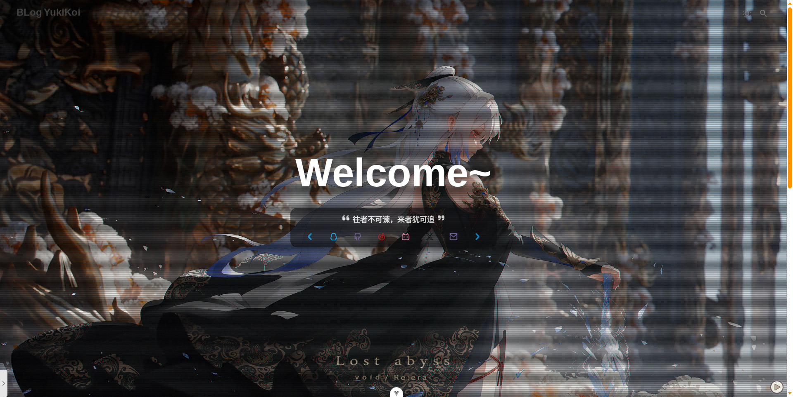

> 本博客使用的主题是 `valaxy-theme-sakura`，地址为 [Valaxy Theme Sakura](https://sakura.valaxy.site/)(点击跳转)

## 🎈 认识 与 安装 `nodejs`、`pnpm`、`valaxy`

###### 在开始搭建博客之前，需要先对使用的工具有所了解：`Node.js`、`pnpm`、`Valaxy`

### 🟢 Node.js

> `Node.js` 是运行 `JavaScript` 的环境，用于在 浏览器 之外 执行 JS 程序

- 它的核心是 `V8引擎`（Google Chrome 也用它来运行 JS）

- 通过 `npm`、`pnpm` 等包管理器可以安装各种开发工具和前端框架

- `Valaxy`、`Vue`、`Vite` 等现代框架都依赖 Node.js 执行

你可以在他的官网找到关于下载的帮助

##### 官网地址 [Node.js](https://nodejs.org/)（点击跳转）

官网给出了非常详细的安装步骤，你可以根据自己的操作系统选择对应版本安装

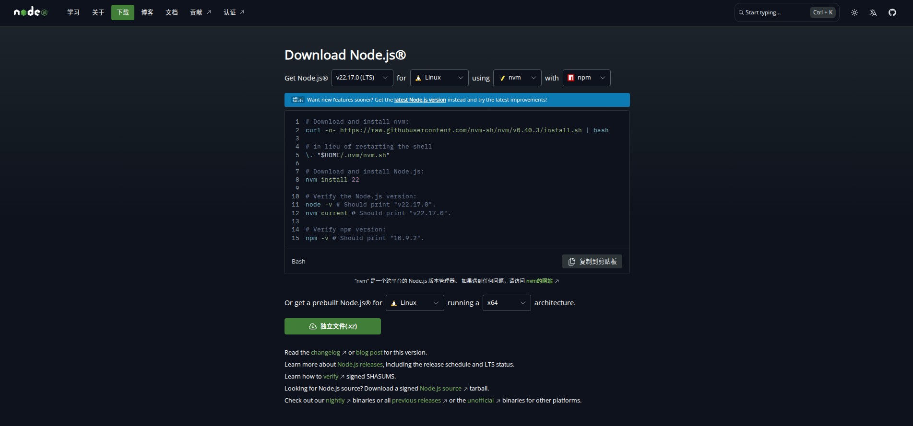

### 🟡 pnpm

> `pnpm` 也是一个包管理器，和 `npm`、`yarn` 一样
>
> 推荐使用它是因为它比其他包管理器更加 **快速**、**轻量**

你可能在安装 `Node.js` 的时候就顺带安装它了，如果没有的话，这里也会给出他的安装命令，使用 `npm` 安装，参数 `-g`（--global） 的意思是全局安装

```bash
npm install -g pnpm
pnpm -v # 检查pnpm版本
```

### 🌸 Valaxy

> Valaxy 是一个基于 Vue 3 + Vite 的现代静态博客框架，专为博客设计

拥有热更新、强大主题系统、Markdown 支持、RSS/标签/分页等功能

它兼容 Vue/Vite 插件，支持 TypeScript 配置和组件覆盖，适合想要高度定制、快速部署的技术型写作者使用。

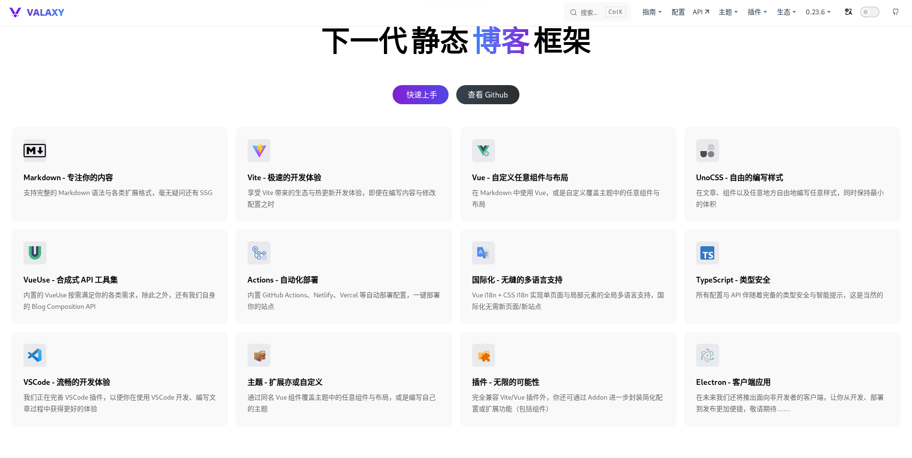

##### 官网地址 [Valaxy](https://valaxy.site/)（点击跳转）

在这里可以查看 Valaxy 相关的配置文档、API、主题、组件库等信息

## 🏗️ `valaxy` 项目初始化 与 主体接入

### 📥 新建项目

###### 完成 `Node.js` 和 `pnpm` 的安装后，就可以开始构建博客项目，Valaxy 提供了非常简单的初始化流程，一条命令就能完成创建

```bash
mkdir my-blog # 创建一个目录来放置博客项目
cd my-blog # 进入目录
pnpm create valaxy # 创建valaxy项目
```

之后会出现一些引导，帮助你初始化项目：

在 `Select a type` 中选择 `Blog`

在 `Choose the agent` 中选择 `pnpm`

```bash
╰─ pnpm create valaxy
.../197e9042afb-d0e9                     |  +28 +++
.../197e9042afb-d0e9                     | Progress: resolved 28, reused 27, downloaded 1, added 28, done

  🌌 Valaxy  v0.23.6

✔ Select a type: › Blog - For Most Users
✔ Project name: … valaxy-blog
  📁 /home/Lian/Documents/my-blog/valaxy-blog

  Scaffolding project in valaxy-blog ...
  Done.

✔ Install and start it now? … yes
✔ Choose the agent › pnpm
```

创建完成后，你应该会看到类似以下输出

```bash
  🌌 Valaxy  v0.23.6

  🪐 theme   > yun (v0.23.6)
  📁 /home/Lian/Documents/my-blog/valaxy-blog

  Preview    > http://localhost:4859/
  Network    > http://192.168.28.131:4859/

  shortcuts  > restart | open | qr | edit
```

访问 `Preview` 或 `Network` 地址，就能在浏览器看到页面了

下次启动时，也只需要来到项目目录下，执行

```bash
pnpm dev
```

### 📚 项目结构介绍

###### 进入 `valaxy-blog`，会看到很多文件，这里简单介绍一下比较基础的部分

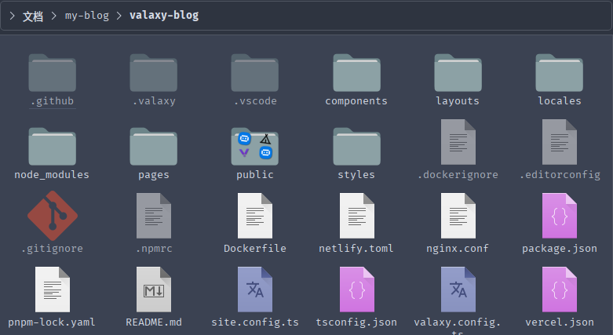

> 对于熟悉 `Vue` 的选手来说，应该对这样的结构不陌生

| 路径/文件          | 说明                                                          |
| ------------------ | ------------------------------------------------------------- |
| `valaxy.config.ts` | 🧠 博客的核心配置文件，主题、菜单、组件等都在这里设置         |
| `site.config.ts`   | 🏷️ 存放站点的基础信息，比如站点名称、作者信息等               |
| `pages/`           | 📝 用来写页面的地方，博客文章则存放在其中的 `/pages/posts` 下 |
| `public/`          | 📂 用于放置资源，比如配置网站、文章中引用的图片、视频等       |
| `package.json`     | 📜 项目元信息 + 脚本命令列表。你可以在这里添加插件、定义命令  |

### 🚀 下载主题

###### `valaxy` 提供了多种主题可供选择，省去了复杂的肉编 `.vue` 烦恼，直接安装主题就可以快速上手

##### 你可以在这里 [Valaxy Themes Gallery](https://valaxy.site/themes/gallery)（点击跳转） 查看他的所有主题

#### ✨ 以 `valaxy-theme-sakura` 主题为例

安装主题

```bash
pnpm add valaxy-theme-sakura
```

配置项目使用这个主题，编辑 `valaxy.config.ts`：

```ts
import type { ThemeUserConfig } from "valaxy-theme-sakura";

export default defineValaxyConfig<ThemeUserConfig>({
  theme: "sakura", // ✅ 使用 sakura 主题
});
```

> 修改或新建 `theme` 参数，将值设置为主题名就行

再次运行项目就能看到主题变化

```bash
pnpm dev
```

##### 前往 `github` 下载该主题的示例作为参考

主题一般都有对应的 `github` 仓库，例如这里使用的 sakura 主题，地址为 [valaxy-theme-sakura](https://github.com/wrxinyue/valaxy-theme-sakura)（点击跳转）

对于大部分主题来说，可以参考官方仓库中的 demo 进行学习

## ⚙️ 配置 BLog

前面的章节中，已经成功的创建并运行了 `Valaxy` 项目，这一部分将会介绍如何初步个性化配置外观与功能

当然，关于更详细的配置细节，可以参考 [Valaxy 官方文档](https://valaxy.site/guide/config/)（点击跳转）和主题对应文档

### 📎 `valaxy.config.ts` 配置

###### 前面已经提到过 ，`valaxy.config.ts` 是博客的核心配置文件，下面会分类介绍他的各个部分

`valaxy.config.ts` 的结构如下

```ts
// 导入需要的类型、函数和组件，例如：
import type { ThemeUserConfig } from "valaxy-theme-sakura";
import { defineValaxyConfig } from "valaxy";
import { addonWaline } from "valaxy-addon-waline";

export default defineValaxyConfig<ThemeUserConfig>({
  // 在这里你可以配置主题参数和它的值
});
```

常见的配置参数包括 `hero`、`PostList`、`navbar`、`sidebar`、`addons` 等，这里都会逐一介绍

#### 📕 首页配置 `hero`

###### `hero` 部份用于配置首页，例如背景图片、视频、标题、横幅等...

以下是一个配置示例：

```ts
hero: {
  // 标题
  title: "Welcome~",
  // 首页标语（当一言禁用时启用）
  motto: "往者不可谏，来者犹可追",
  // 首页轮播图片
  urls: [
    "https://valaxy-theme-sakura.s3.bitiful.net/wallpaper-2025%2Fwallhaven-858k3j.jpg",
    "https://valaxy-theme-sakura.s3.bitiful.net/wallpaper-2025%2Fwallhaven-3l2vm3.jpg",
    "https://valaxy-theme-sakura.s3.bitiful.net/wallpaper-2025%2Fwallhaven-zyxq6j.jpg",
    "https://valaxy-theme-sakura.s3.bitiful.net/wallpaper-2025%2Fwallhaven-yxoejx.jpg",
  ],
  randomUrls: true,
  // 首页视频
  playerUrl: "output.mp4",
  // 背景图片过滤样式，可选 filter-dot、filter-dim、filter=grid
  style: "filter-grid",
  // 固定背景图片
  fixedImg: true,
  // 首页标语 打字机效果
  typewriter: true,
  // 启用一言（将首页标语替换为随机文字）
  enableHitokoto: false,
  // 背景哦狼主题，可选fish、horizontal、ripple、yunCloud
  waveTheme: "fish",
},
```

#### 📕 卡片配置 `PostList`

###### `PostList` 部分配置首页文章列表的卡片展示

以下是一个配置示例：

```ts
postList: {
  // 小标题文字
  text: "Discovery",

  // 图片反转
  isImageReversed: true,
  // 封面图片（这里使用了两个API）
  defaultImage: [
    "https://img.xjh.me/random_img.php?random?type=bg&return=302",
    "https://www.dmoe.cc/random.php?random",
  ],
},
```

#### 📕 电脑端菜单 `navbar`

###### `navbar` 部分用于配置大屏情况（平板、电脑窗口）下时，顶部菜单栏的样式

##### 基本格式为

```ts
navbar: [
  {
    icon: "图标"，
    text: "显示文本",
    link: "链接",
    target: "跳转方式",
    items: [
      {
        icon: "图标"，
        text: "显示文本",
        link: "链接",
        target: "跳转方式",
      },
    ],
  },
],
```

以下是一个配置示例：

```ts
navbar: [
  {
    icon: "i-fa-fort-awesome",
    locale: "menu.home",
    // 首页
    link: "/",
  },
  {
    icon: "i-line-md-folder-twotone",
    locale: "menu.categories",
    // 对应 pages/categories/index.md
    link: "/categories",
  },
  {
    icon: "i-fa-archive",
    locale: "menu.archives",
    // 对应 pages/archives/index.md
    link: "/archives",
  },
  {
        icon: "i-fa6-solid:file-image",
        text: "相册",
        // link 可以直接为空，表示不跳转
        link: "",
        items: [
          {
            text: "现实",
            icon: "i-fa6-solid:camera-retro",
            // 对应 pages/lightgallery/reality/index.md
            link: "/lightgallery/reality",
          },
          {
            text: "女装",
            icon: "i-fa6-solid:heart",
            // 对应 pages/lightgallery/dress/index.md
            link: "/lightgallery/dress",
          },
        ],
      },
  {
    icon: "i-fa-film",
    text: "番剧",
    // 对应 pages/anime/index.md
    link: "/anime",
  },
  {
    icon: "i-fa-edit",
    text: "留言板",
    // 对应 pages/comment/index.md
    link: "/comment",
  },
  {
    text: "友情链接",
    icon: "i-fa-chain",
    // 对应 pages/links/index.md
    link: "/links",
    // items 里可以配置二级菜单栏
    items: [
      {
        text: "GitHub",
        icon: "i-line-md-github-twotone",
        // 跳转到外部链接
        link: "https://github.com/WRXinYue/valaxy-theme-sakura",
        // target 就是 html 中的 <a target="...">，有四种标准值可选，默认为 _self
        target: "_blank",
      },
      {
        text: "Valaxy",
        icon: "i-ri-cloud-fill",
        link: "https://github.com/YunYouJun/valaxy",
        target: "_blank",
      },
    ],
  },
  {
    text: pkg.author.name,
    icon: "i-line-md-hazard-lights-filled",
    // 这部分需要在 valaxy.config.ts 头部导入的 package.json 里面配置
    link: pkg.author.url,
    target: "_blank",
  },
  {
    text: "关于",
    icon: "i-fa-leaf",
    // 这部分需要在 valaxy.config.ts 头部导入的 package.json 里面配置
    link: pkg.author.url,
    target: "_blank",
  },
  {
    icon: "i-fa6-solid:bookmark",
    text: "标签",
    // 对应 pages/tags/index.md
    link: "/tags",
  },
  {
    text: "RSS",
    icon: "i-fa-feed",
    // 这个路径会 valaxy build 自动生成
    link: "/atom.xml",
    target: "_blank",
  },
],
```

效果预览：

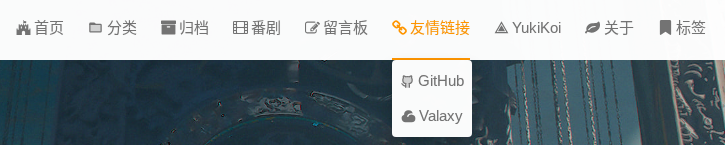

> `icon` 部分支持 unocss + Iconify 图标系统，你可以在 [Icones](https://icones.js.org/) （点击跳转）获取调用代码
>
> 与 `pkg.author.url` 相关的配置，需要到 `valaxy.config.ts` 头部导入的 `package.json`（并非根目录的`package.json`） 里面修改，如果你使用的 IDE 有跳转功能，会很容易找到，这里提供一个大概的位置
>
> node_modules/.pnpm/你使用的主题/node_modules/使用的主题/package

这里也提供一个该配置文件的参考：

```json
{
  "name": "valaxy-theme-sakura",
  "version": "0.9.4",
  // 用户信息
  "author": {
    "email": "yichengxin7@gmail.com",
    "name": "YukiKoi",
    "url": "https://yeastar.xin"
  },
  "homepage": "https://github.com/Yueosa/BLog",
  "repository": {
    "type": "git",
    "url": "https://github.com/Yueosa/BLog.git"
  },
  "publishConfig": {
    "@wrxinyue:registry": "https://npm.pkg.github.com"
  },
  "keywords": ["valaxy", "theme", "sakura", "vue"],
  "main": "client/index.ts",
  "types": "types/index.d.ts",
  "peerDependencies": {
    "valaxy-addon-hitokoto": "^0.0.1",
    "valaxy-addon-vercount": "^0.0.6"
  },
  "dependencies": {
    "@ctrl/tinycolor": "^4.1.0",
    "@iconify-json/fa6-solid": "^1.2.3",
    "@iconify-json/mdi": "^1.2.3",
    "interactjs": "^1.10.27",
    "lenis": "^1.2.3",
    "typeit": "^8.8.7"
  },
  "devDependencies": {
    "@interactjs/types": "^1.10.27",
    "valaxy": "^0.23.3"
  },
  "scripts": {
    "release": "bumpp && npm publish"
  }
}
```

#### 📕 手机端侧边栏 `sidebar`

###### `sidebar` 的配置和 `navbar` 基本相同，不过他是服务于小屏设备的，会表现为一个侧边栏

以下为配置示例

```ts
sidebar: [
  {
    text: "🌈",
    locale: "menu.home",
    link: "/",
  },
  {
    text: "🗂️",
    locale: "menu.archives",
    link: "/archives/",
  },
  {
    text: "📂",
    locale: "menu.categories",
    link: "/categories/",
  },
  {
    text: "🏷️",
    locale: "menu.tags",
    link: "/tags/",
  },
  {
    text: "🎯 清单",
    items: [
      {
        text: "电影 🎞️",
        link: "/movie",
      },
      {
        text: "番剧 🍨",
        link: "/anime",
      },
      {
        text: "游戏 🎮",
        link: "/game",
      },
      {
        text: "歌单 🎵",
        link: "/music",
      },
    ],
  },
  {
    text: "📝 留言板",
    link: "/comment",
  },
  {
    text: "🍻 朋友圈",
    link: "/links",
  },
  {
    text: "❤️ 打赏",
    link: "/posts/reward",
  },
  {
    text: "📌",
    locale: "menu.about",
    link: "https://github.com/Yueosa",
  },
],
```

#### 📗 额外组件 `addons`

###### `Valaxy` 支持接入额外组件实现更多功能，例如网站统计，评论区，相册等等

配置额外组件之前，推荐你先了解 [📎 `/pages/posts`](#pages-posts-note) （点击跳转）

#### 📗 `addon-Waline` 评论区 配置

###### `Waline` 的配置较为复杂，这里将分为三部分细说，当然你也可以直接参阅他们的配置文档：[github 仓库地址](https://github.com/walinejs/waline) | [配置说明文件](https://waline.js.org/guide/get-started/)

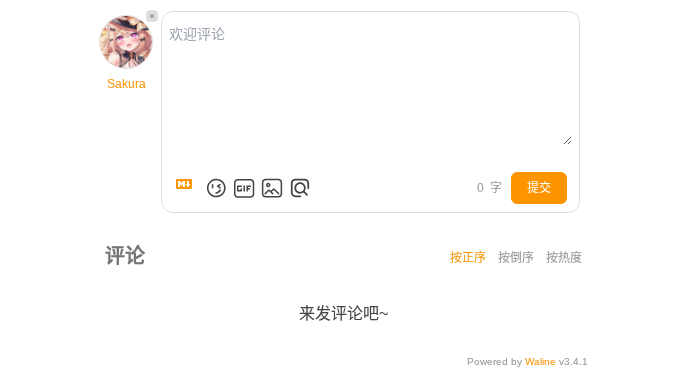

评论区需要三个部分

| 名称   | 作用                 |
| ------ | -------------------- |
| 数据库 | 存储评论数据         |
| 服务端 | 提供评论区服务       |
| 客户端 | 用于访问 waline 服务 |

> 这里会演示 `LeanCloud`（云数据库） + `Vercel`（云部署） + `valaxy-
addon-waline`（valaxy 官方提供的插件）来进行实现
>
> 当然你也可以选择本地部署服务、或者部署到你自己的云服务器上

##### `LeanCloud` 部署

###### `LeanCloud` 是一个轻量而稳定的云数据库服务，它将作为 `Waline` 的后端数据存储，用于保存评论内容、访客信息等数据

- 首先推荐注册 `LeanCloud 国际版`，这里是他的地址：[LeanCloud](https://console.leancloud.app/apps)（点击跳转）
- 完成注册后，创建一个新的应用（版本可以选择免费的开发版）
- 然后进入 设置 -> 应用凭证，记录你的 `APP ID`、`APP Key`、`Master Key`

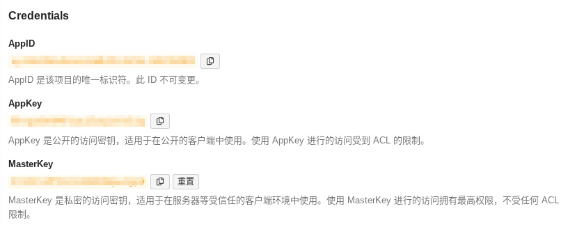

> 至此我们已经创建了一个 **云数据库**，并且得到了他的 **访问密钥**

##### 🤝 你需要一个 GitHub 账号

###### Vercel 是一个专注于前端和 Serverless 项目的部署平台，它通过与你的 GitHub 仓库绑定，实现自动构建与托管。因此，在部署 Waline 服务端前，请确保你已有一个可用的 [GitHub 账号](https://github.com/)。

如果你还没有账号，可以几分钟内免费注册一个 —— 它在整个前后端开发与部署过程中都是不可或缺的伙伴。

##### `Vercel` 部署

###### `Vercel` 是一个简单、快速的 Serverless 平台，用于托管 `Waline` 的服务端程序

- 点击这个链接 -> [Deploy](https://vercel.com/new/clone?repository-url=https%3A%2F%2Fgithub.com%2Fwalinejs%2Fwaline%2Ftree%2Fmain%2Fexample) 就能一键跳转到 `Vercel` 进行部署，如果你没有账号，请使用 `Github` 账号进行登录
- `Git Scope` 选择你的 `Github` 账号，然后输入一个你喜欢的项目名称，点击 `Create`，`Vercel` 会基于 `Waline` 的模板帮你自动创建仓库
- 等待 1-2 分钟创建成功后，进入 `Settings` - `Environment Variables`，你需要在这里配置三个环境变量 `LEAN_ID`、`LEAN_KEY`、`LEAN_MASTER_KEY`，他们值对应你在 `LeanCloud` 中获取的 `APP ID`、`APP Key`、`Master Key`
- 配置完成后点击 `Redeploy` 重新部署（这是为了更新环境变量），等待 `STATUS` 显示为 `Ready` 后，点击 `Visit` 就能跳转到你的 **服务地址**

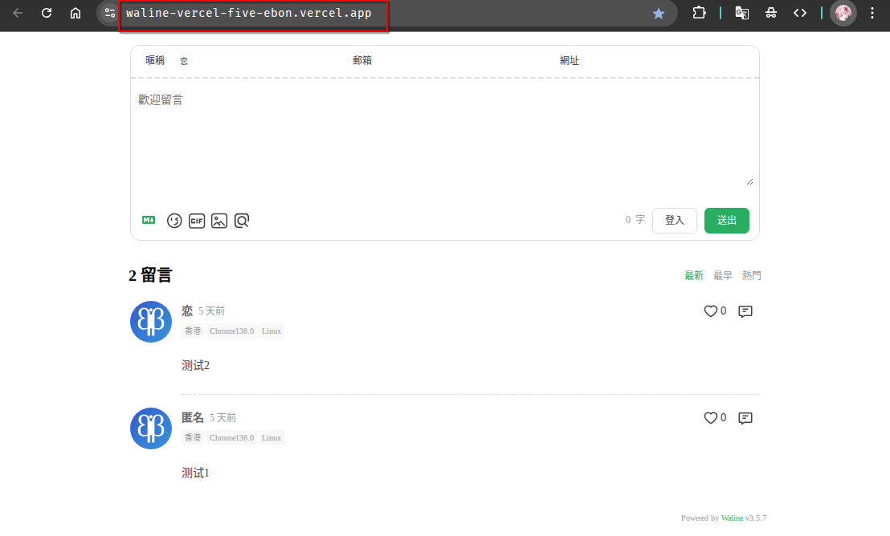

> 至此我们已经完成了`Waline`后端服务的配置，并且拿到了他的 **服务地址**

##### `Valaxy` 接入

安装 `valaxy-addon-waline` 组件

```bash
pnpm add @valaxy/addon-waline
```

在 `valaxy.config.ts` 中使用

```ts
import { addonWaline } from "@valaxy/addon-waline";

export default defineValaxyConfig({
  addons: [
    addonWaline({
      serverURL: "https://waline-vercel-five-ebon.vercel.app/", // 你的 waline 服务地址
      pageview: true,
      comment: true,
    }),
  ],
});
```

在需要开启评论的页面的 `index.md` 头部写入 `comment: true` 即可（pages/posts/ 默认开启）

##### 评论管理

部署完毕后，直接进入 `<serverURL>/ui/register` 进行注册，第一个注册的用户将会成为管理员

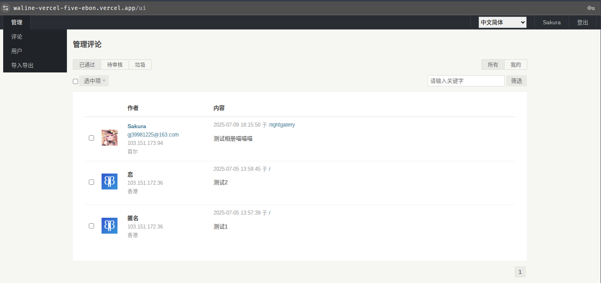

管理员可以管理所有评论信息，用户信息

#### 📗 `addon-Meting` 网易云歌单 接入

###### 网易云音乐的相关配置就简单很多，只需要获取歌单 id，利用组件嵌入即可

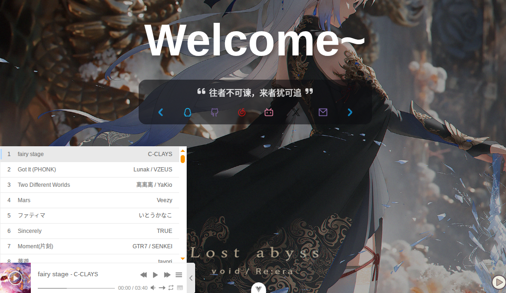

安装 `addon-meting` 组件

```bash
pnpm add @valaxy/addon-meting
```

在 `valaxy.config.ts` 中使用

```ts
import { addonMeting } from "valaxy-addon-meting";

export default defineValaxyConfig<ThemeUserConfig>({
  addons: [
    addonMeting({
      global: true,
      props: {
        id: "13729316168", // 你的网易云歌单ID
        server: "netease",
        type: "playlist",
      },
      options: {
        autoHidden: true,
        animationIn: true,
        lyricHidden: true,
      },
    }),
  ],
});
```

> 关于组件的更多信息可以查看这个文档 [valaxy-addon-meting](https://github.com/YunYouJun/valaxy/tree/main/packages/valaxy-addon-meting)（点击跳转）

#### 📗 `addon-Bangumi` BiliBili 番剧列表 获取

###### 接入番剧的工作也和 `meting` 差不多，使用 `bilibiliUid` 即可获取列表，注意需要在 `bilibili` 将 “我的追番” 设置为公开

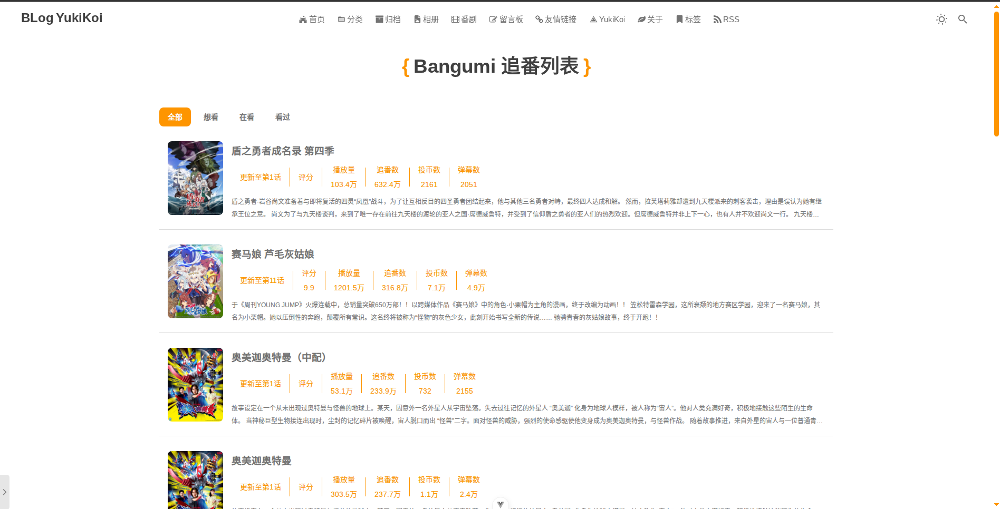

安装 `addon-bangumi` 组件

```bash
pnpm add valaxy-addon-bangumi
```

在 `valaxy.config.ts` 中使用

```ts
import { addonMeting } from "valaxy-addon-bangumi";

export default defineValaxyConfig<ThemeUserConfig>({
  addons: [
    addonBangumi({
      api: "https://yi_xiao_jiu-bangumi.web.val.run",
      bilibiliUid: "433677987", // 你的bilibiliUid
      bgmEnabled: false,
    }),
  ],
});
```

> 关于组件的更多信息可以查看这个文档 [valaxy-addon-bangumi](https://github.com/YunYouJun/valaxy/tree/main/packages/valaxy-addon-bangumi)（点击跳转）

#### 📗 `addon-lightgallery` 相册 展示

###### 这个组件用于展示图片，并且提供放大查看、下载等功能

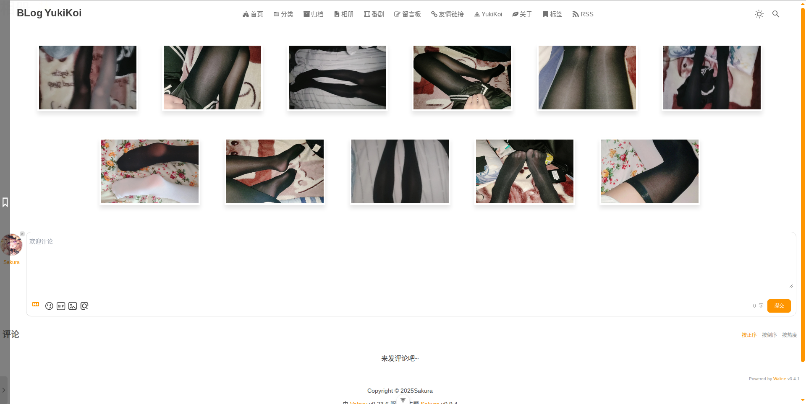

##### 🧩 安装 `valaxy-addon-lightgallery` 组件

```bash
pnpm add valaxy-addon-lightgallery
```

在 `valaxy.config.ts` 中使用

```ts
import { addonLightGallery } from "valaxy-addon-lightgallery";

export default defineValaxyConfig<ThemeUserConfig>({
  addons: [addonLightGallery()],
});
```

### 📎 `site-config` 配置

| 正在施工

### 📎 `/pages/posts` 简单说明 {#pages-posts-note}

| 正在施工

### 📎 基于 `VPS` 的 部署方案

| 正在施工

## ❓ 常见问题

### 📘 不显示图标/ icon: "xxx" 无法调用图标

可能是因为缺少 `@iconify-json/fa`、`@iconify-json/line-md` 组件库

```bash
pnpm add @iconify-json/fa @iconify-json/line-md # 使用pnpm安装，之后pnpm dev 重启项目即可
```

### 📘 修改配置文件后浏览器内没有变化

除去配置问题，页面不刷新/无变化极有可能是因为浏览器/项目缓存导致，可以尝试在 f12 中选择 “停用缓存”，或直接使用 无痕页面 打开，同时重启 valaxy 项目

---
